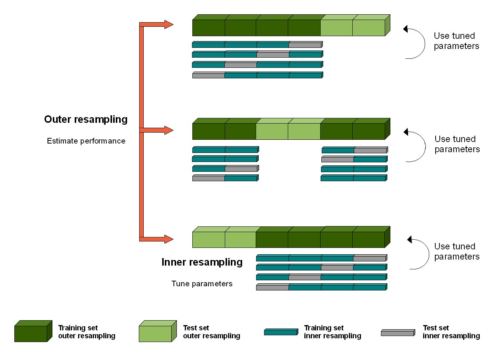

## Nested Resampling {#nested-resampling}

In order to obtain unbiased performance estimates for learners, all parts of the model building (preprocessing and model selection steps) should be included in the resampling, i.e., repeated for every pair of training/test data.
For steps that themselves require resampling like hyperparameter tuning or feature-selection (via the wrapper approach) this results in two nested resampling loops.



The graphic above illustrates nested resampling for parameter tuning with 3-fold cross-validation in the outer and 4-fold cross-validation in the inner loop.

In the outer resampling loop, we have three pairs of training/test sets.
On each of these outer training sets parameter tuning is done, thereby executing the inner resampling loop.
This way, we get one set of selected hyperparameters for each outer training set.
Then the learner is fitted on each outer training set using the corresponding selected hyperparameters.
Subsequently, we can evaluate the performance of the learner on the outer test sets.

In [mlr3](https://mlr3.mlr-org.com), you can run nested resampling for free without programming any loops by using the [`mlr3tuning::AutoTuner`](https://mlr3tuning.mlr-org.com/reference/AutoTuner.html) class.
This works as follows:

1. Generate a wrapped Learner via class [`mlr3tuning::AutoTuner`](https://mlr3tuning.mlr-org.com/reference/AutoTuner.html) or `mlr3filters::AutoSelect` (not yet implemented).
2. Specify all required settings - see section ["Automating the Tuning"](#autotuner) for help.
3. Call function [`resample()`](https://mlr3.mlr-org.com/reference/resample.html) or [`benchmark()`](https://mlr3.mlr-org.com/reference/benchmark.html) with the created [`Learner`](https://mlr3.mlr-org.com/reference/Learner.html).

You can freely combine different inner and outer resampling strategies.

A common setup is prediction and performance evaluation on a fixed outer test set.
This can be achieved by passing the [`Resampling`](https://mlr3.mlr-org.com/reference/Resampling.html) strategy (`rsmp("holdout")`) as the outer resampling instance to either [`resample()`](https://mlr3.mlr-org.com/reference/resample.html) or [`benchmark()`](https://mlr3.mlr-org.com/reference/benchmark.html).

The inner resampling strategy could be a cross-validation one (`rsmp("cv")`) as the sizes of the outer training sets might differ.
Per default, the inner resample description is instantiated once for every outer training set.

Note that nested resampling is computationally expensive.
For this reason we use relatively small search spaces and a low number of resampling iterations in the examples shown below.
In practice, you normally have to increase both.
As this is computationally intensive you might want to have a look at the section on [Parallelization](#parallelization).

### Execution {#nested-resamp-exec}

To optimize hyperparameters or conduct feature selection in a nested resampling you need to create learners using either:

* the [`AutoTuner`](https://mlr3tuning.mlr-org.com/reference/AutoTuner.html) class, or
* the `mlr3filters::AutoSelect` class (not yet implemented)

We use the example from section ["Automating the Tuning"](#autotuner) and pipe the resulting learner into a [`resample()`](https://mlr3.mlr-org.com/reference/resample.html) call.


```r
library("mlr3tuning")
task = tsk("iris")
learner = lrn("classif.rpart")
resampling = rsmp("holdout")
measure = msr("classif.ce")
param_set = paradox::ParamSet$new(
  params = list(paradox::ParamDbl$new("cp", lower = 0.001, upper = 0.1)))
terminator = trm("evals", n_evals = 5)
tuner = tnr("grid_search", resolution = 10)

at = AutoTuner$new(learner, resampling, measure = measure,
  param_set, terminator, tuner = tuner)
```

Now construct the [`resample()`](https://mlr3.mlr-org.com/reference/resample.html) call:


```r
resampling_outer = rsmp("cv", folds = 3)
rr = resample(task = task, learner = at, resampling = resampling_outer)
```

```
## INFO  [10:44:44.152] Starting to optimize 1 parameter(s) with '<OptimizerGridSearch>' and '<TerminatorEvals>' 
## INFO  [10:44:44.192] Evaluating 1 configuration(s) 
## INFO  [10:44:44.308] Result of batch 1: 
## INFO  [10:44:44.311]     cp classif.ce                                uhash 
## INFO  [10:44:44.311]  0.034     0.0303 8e61bfa7-fcd2-4051-806f-0eb896b87eff 
## INFO  [10:44:44.313] Evaluating 1 configuration(s) 
## INFO  [10:44:44.514] Result of batch 2: 
## INFO  [10:44:44.517]     cp classif.ce                                uhash 
## INFO  [10:44:44.517]  0.078     0.0303 b3c24d9c-317e-4569-bc69-911b8bf1f85c 
## INFO  [10:44:44.519] Evaluating 1 configuration(s) 
## INFO  [10:44:44.623] Result of batch 3: 
## INFO  [10:44:44.625]     cp classif.ce                                uhash 
## INFO  [10:44:44.625]  0.012     0.0303 4945ba96-6795-4a22-b1a3-8d86cb13a20f 
## INFO  [10:44:44.628] Evaluating 1 configuration(s) 
## INFO  [10:44:44.726] Result of batch 4: 
## INFO  [10:44:44.728]     cp classif.ce                                uhash 
## INFO  [10:44:44.728]  0.056     0.0303 a04bbc18-44a5-4371-b28c-9cd1eeb9b7f7 
## INFO  [10:44:44.731] Evaluating 1 configuration(s) 
## INFO  [10:44:44.818] Result of batch 5: 
## INFO  [10:44:44.821]     cp classif.ce                                uhash 
## INFO  [10:44:44.821]  0.067     0.0303 a805b35f-8bfe-40c5-aaec-9d610522b48c 
## INFO  [10:44:44.829] Finished optimizing after 5 evaluation(s) 
## INFO  [10:44:44.830] Result: 
## INFO  [10:44:44.832]     cp learner_param_vals  x_domain classif.ce 
## INFO  [10:44:44.832]  0.034          <list[2]> <list[1]>     0.0303 
## INFO  [10:44:44.876] Starting to optimize 1 parameter(s) with '<OptimizerGridSearch>' and '<TerminatorEvals>' 
## INFO  [10:44:44.879] Evaluating 1 configuration(s) 
## INFO  [10:44:44.963] Result of batch 1: 
## INFO  [10:44:44.965]     cp classif.ce                                uhash 
## INFO  [10:44:44.965]  0.078     0.0303 5c2035c6-3832-4374-a556-23068f54596b 
## INFO  [10:44:44.967] Evaluating 1 configuration(s) 
## INFO  [10:44:45.052] Result of batch 2: 
## INFO  [10:44:45.054]     cp classif.ce                                uhash 
## INFO  [10:44:45.054]  0.034     0.0303 b26edc5d-4e0e-4532-ad3c-9b37e25beac3 
## INFO  [10:44:45.057] Evaluating 1 configuration(s) 
## INFO  [10:44:45.139] Result of batch 3: 
## INFO  [10:44:45.142]     cp classif.ce                                uhash 
## INFO  [10:44:45.142]  0.023     0.0303 0ab54f34-1b7c-42d5-9169-c4fd518471cd 
## INFO  [10:44:45.144] Evaluating 1 configuration(s) 
## INFO  [10:44:45.230] Result of batch 4: 
## INFO  [10:44:45.232]     cp classif.ce                                uhash 
## INFO  [10:44:45.232]  0.001     0.0303 83122a56-3a3b-4724-9577-c8b064884e5a 
## INFO  [10:44:45.234] Evaluating 1 configuration(s) 
## INFO  [10:44:45.327] Result of batch 5: 
## INFO  [10:44:45.329]     cp classif.ce                                uhash 
## INFO  [10:44:45.329]  0.089     0.0303 91c761ee-7664-45a7-9008-d0bfba8f5ad7 
## INFO  [10:44:45.336] Finished optimizing after 5 evaluation(s) 
## INFO  [10:44:45.337] Result: 
## INFO  [10:44:45.339]     cp learner_param_vals  x_domain classif.ce 
## INFO  [10:44:45.339]  0.078          <list[2]> <list[1]>     0.0303 
## INFO  [10:44:45.389] Starting to optimize 1 parameter(s) with '<OptimizerGridSearch>' and '<TerminatorEvals>' 
## INFO  [10:44:45.393] Evaluating 1 configuration(s) 
## INFO  [10:44:45.480] Result of batch 1: 
## INFO  [10:44:45.482]     cp classif.ce                                uhash 
## INFO  [10:44:45.482]  0.089    0.06061 26481e45-a404-4785-bcdf-2fd2d3a0681e 
## INFO  [10:44:45.485] Evaluating 1 configuration(s) 
## INFO  [10:44:45.572] Result of batch 2: 
## INFO  [10:44:45.574]     cp classif.ce                                uhash 
## INFO  [10:44:45.574]  0.045    0.06061 7f2257e5-8025-4244-85c0-07bd4ae07d02 
## INFO  [10:44:45.577] Evaluating 1 configuration(s) 
## INFO  [10:44:45.666] Result of batch 3: 
## INFO  [10:44:45.668]   cp classif.ce                                uhash 
## INFO  [10:44:45.668]  0.1    0.06061 d1debb2e-195b-446c-8b37-2aa5d474c055 
## INFO  [10:44:45.670] Evaluating 1 configuration(s) 
## INFO  [10:44:45.756] Result of batch 4: 
## INFO  [10:44:45.758]     cp classif.ce                                uhash 
## INFO  [10:44:45.758]  0.001    0.06061 16dd0e5d-50e1-4479-8411-f7d2b33a403e 
## INFO  [10:44:45.760] Evaluating 1 configuration(s) 
## INFO  [10:44:45.854] Result of batch 5: 
## INFO  [10:44:45.856]     cp classif.ce                                uhash 
## INFO  [10:44:45.856]  0.067    0.06061 4a80e473-ace7-4059-8d61-a0c2e26f34fa 
## INFO  [10:44:45.862] Finished optimizing after 5 evaluation(s) 
## INFO  [10:44:45.863] Result: 
## INFO  [10:44:45.865]     cp learner_param_vals  x_domain classif.ce 
## INFO  [10:44:45.865]  0.089          <list[2]> <list[1]>    0.06061
```

### Evaluation {#nested-resamp-eval}

With the created [`ResampleResult`](https://mlr3.mlr-org.com/reference/ResampleResult.html) we can now inspect the executed resampling iterations more closely.
See the section on [Resampling](#resampling) for more detailed information about [`ResampleResult`](https://mlr3.mlr-org.com/reference/ResampleResult.html) objects.

For example, we can query the aggregated performance result:


```r
rr$aggregate()
```

```
## classif.ce 
##    0.07333
```

Check for any errors in the folds during execution (if there is not output, warnings or errors recorded, this is an empty `data.table()`:


```r
rr$errors
```

```
## Empty data.table (0 rows and 2 cols): iteration,msg
```

Or take a look at the confusion matrix of the joined predictions:


```r
rr$prediction()$confusion
```

```
##             truth
## response     setosa versicolor virginica
##   setosa         50          0         0
##   versicolor      0         48         9
##   virginica       0          2        41
```
